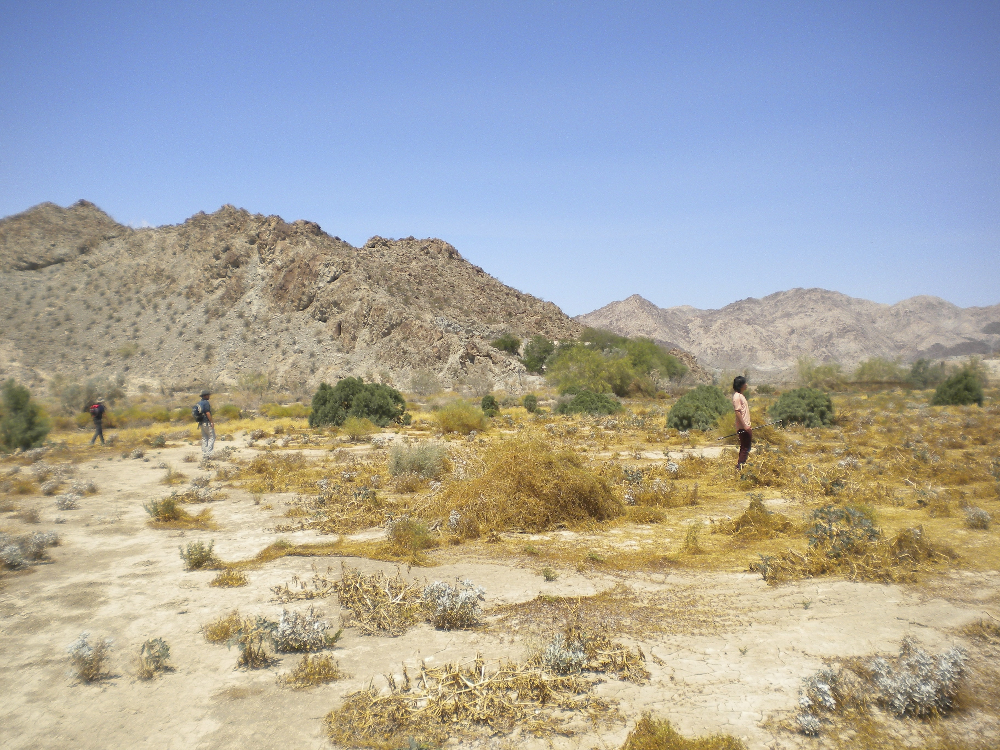
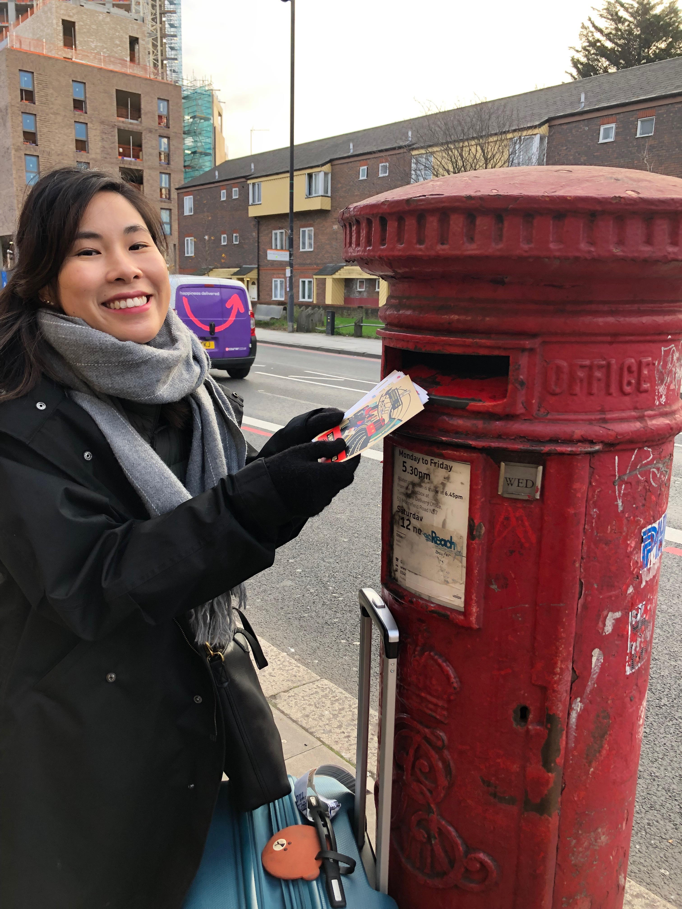

```{r setup, include=FALSE}
knitr::opts_chunk$set(echo = FALSE)
```

### Experience

I graduated from the University of California, Los Angeles in 2014 with a B.S. in Ecology, Behavior, and Evolution. As an undergraduate student, I conducted field ecology research utilizing species distribution modeling, leading a herpetology bioinventory project in the Mojave Desert. After graduating, I spent two years working in the education field in China, where I witnessed a neighboring orchard and forest be converted into a shopping mall. The experience highlighted the environmental damage that can happen with development and inspired my interest in the applications of science and management to solve global environmental issues. This led me to working in the environmental nonprofit sector for the next three years. 

At Sustainable San Mateo County, I identified solutions that individuals, decision makers, and communities can take toward more sustainable futures at the intersection of economy, equity, and the environment. I also worked at the Biodiversity Funders Group, a professional association of environmental grantmakers, where I conducted research into current environmental issues, organized gatherings and webinars on various topics, and engaged in outreach to foster collaboration amongst environmental grantmakers. I'm pursuing a specialization in Conservation Planning at the Bren School, interested in natural resource ecology and management. I aspire to contribute to sustainable methods of producing healthy and culturally-appropriate food to meet global food security needs.



### Interests

I'm often found outdoors, either hiking, swimming, biking, playing tennis, or gardening. When not enjoying nature, I can be found drinking coffee or tea, looking up new baking recipes, consuming anything related to Sherlock Holmes, scrapbooking, and visiting museums and botanical gardens. I love to travel and am always eagerly planning my next adventure.




